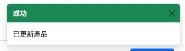

# 第七週 - Redux 與 Redux Toolkit

> 2024 React 作品實戰冬季班 - hexschool

本專案支援 Node.js 執行環境，必須要安裝 **v16.0.0 LTS** 以上版本。

此模板提供了一個最小的設置，以便在 Vite 中使用 React，並支持 HMR 和一些 ESLint 規則。

目前，有兩個官方插件可用：

- [@vitejs/plugin-react](https://github.com/vitejs/vite-plugin-react/blob/main/packages/plugin-react/README.md) 使用 [Babel](https://babeljs.io/) 進行快速刷新
- [@vitejs/plugin-react-swc](https://github.com/vitejs/vite-plugin-react-swc) 使用 [SWC](https://swc.rs/) 進行快速刷新

### 完成條件

- 請透過 GitHub Repo、GitHub Pages 提交作業（需正常開啟），以方便助教與講師檢視
- 須自行撰寫 React，若有參考同學作業，請附上參考來源
- 請勿將提問的問題寫在程式碼中
- 回報時務必要附上 Discord 名稱、作業等級 .. 等完整繳交內容
- 需至少完成 Lv1 作業等級
- 以上需符合規定，否則會審核失敗

### 此任務你會獲得以下技能

- 示範後台製作
- 最終作業規劃技巧 User Story、素材搜集
- Redux toolkit

## 指令列表

- `npm install` - 初次下載該專案後，需要使用 `npm install` 來安裝套件
- `npm run dev` - 啟動開發伺服器
  - 若沒有自動開啟瀏覽器，可嘗試手動在瀏覽器上輸入 `http://localhost:5173/ReactWorkshop_2024_Week2_Hexschool/`
- `npm run build` - 打包專案
- `npm run preview` - 預覽打包後的專案
- `npm run deploy` - 進行自動化部署

## 資料夾結構

當前專案的資料夾及檔案結構如下：

```
|   .copilot-commit-message-instructions.md
|   .env
|   .gitignore
|   eslint.config.js
|   index.html
|   package-lock.json
|   package.json
|   README.md
|   vite.config.js
|                 
+---public
|       vite.svg
|       
+---specs
|       
\---src
    |   App.css
    |   App.jsx
    |   index.css
    |   main.jsx
    |   routes.jsx
    |   
    +---assets
    |       react.svg
    |       
    +---components
    |           
    +---layouts
    |       AdminLayout.jsx
    |       FrontendLayout.jsx
    |       
    +---pages
    |   +---admin
    |   |       AdminOrders.jsx
    |   |       AdminProducts.jsx
    |   |       
    |   \---front
    |       |   Cart.jsx
    |       |   FrontendLayout.jsx
    |       |   Home.jsx
    |       |   NotFound.jsx
    |       |   Product.jsx
    |       |   SingleProduct.jsx
    |       |   
    |       \---Login
    |               index.jsx
    |               Login.css
    |               
    \---utils
            auth.js
```

# 資料夾結構

當前專案的資料夾及檔案結構如下：

```
|   .copilot-commit-message-instructions.md
|   .env
|   .gitignore
|   eslint.config.js
|   index.html
|   ouput.txt
|   package-lock.json
|   package.json
|   README.md
|   vite.config.js
|       
+---public
|       vite.svg
|       
\---src
    |   App.css
    |   App.jsx
    |   index.css
    |   main.jsx
    |   routes.jsx
    |   
    +---assets
    |       react.svg
    |       
    +---components
    |   |   AddToCartModal.jsx
    |   |   ClearCartModal.jsx
    |   |   MessageToast.jsx
    |   |   Pagination.jsx
    |   |   RemoveCartItemModal.jsx
    |   |   
    |   +---FullPageLoading
    |   |       FullPageLoading.css
    |   |       index.jsx
    |   |       
    |   \---ProductModal
    |           index.jsx
    |           ProductModal.css
    |           
    +---layouts
    |       AdminLayout.jsx
    |       FrontendLayout.jsx
    |       
    +---pages
    |   +---admin
    |   |       AdminOrders.jsx
    |   |       AdminProducts.jsx
    |   |       
    |   \---front
    |       |   Cart.jsx
    |       |   FrontendLayout.jsx
    |       |   Home.jsx
    |       |   NotFound.jsx
    |       |   Product.jsx
    |       |   SingleProduct.jsx
    |       |   
    |       \---Login
    |               index.jsx
    |               Login.css
    |               
    +---store
    |       messageSlice.js
    |       store.js
    |       
    \---utils
            auth.js
```

**根目錄**

- `.copilot-commit-message-instructions.md`：提供有關提交訊息的規範資訊。
- `.gitignore`：列出應該被 Git 忽略的檔案和目錄。
- `eslint.config.js`：ESLint 的配置檔案，用於設定程式碼檢查規則。
- `index.html`：專案的主 HTML 檔案，包含應用的根元素。
- `package-lock.json`：鎖定專案相依套件版本的檔案。
- `package.json`：專案的配置檔案，包含專案名稱、版本、相依套件和腳本等資訊。
- `README.md`：專案的說明文件，包含專案介紹、指令列表和資料夾結構等資訊。
- `vite.config.js`：Vite 的配置檔案，用於設定開發伺服器和打包選項。

**`public/` 資料夾**

- `vite.svg`：Vite 的標誌檔案。

**`src/` 資料夾**

- `App.css`：主要的樣式檔案，包含應用的樣式定義。
- `App.jsx`：主要的 React 元件，負責渲染應用的主要內容。
- `index.css`：全域樣式檔案，包含應用的基本樣式定義。
- `main.jsx`：入口檔案，負責渲染 `App` 元件。
- `routes.jsx`：定義應用程式的路由。

**`assets/` 資料夾**

- `react.svg`：React 的標誌檔案。

**`components/` 資料夾**

- 用於存放 React 元件。

**`layouts/` 資料夾**

- `AdminLayout.jsx`：後台管理頁面的佈局元件。
- `FrontendLayout.jsx`：前台頁面的佈局元件。

**`pages/` 資料夾**

- 存放各個頁面元件。
  - `admin/`：後台管理頁面
    - `AdminOrders.jsx`：後台訂單管理頁面。
    - `AdminProducts.jsx`：後台產品管理頁面。
  - `front/`：前台頁面
    - `Cart.jsx`：購物車頁面。
    - `Home.jsx`：首頁。
    - `NotFound.jsx`：404 錯誤頁面。
    - `Product.jsx`：產品列表頁面。
    - `SingleProduct.jsx`：單一產品詳細資訊頁面。
  - `Login/`：登入頁面
    - `index.jsx`：登入頁面的主要元件。
    - `Login.css`：登入頁面的樣式檔案。

**`store/` 資料夾**

- `messageSlice.js`：包含 Redux 切片，用於管理訊息狀態。
- `store.js`：設定 Redux store，並整合所有的切片。

**`utils/` 資料夾**

- `auth.js`：包含身份驗證相關的函式。

### 任務描述

## 主線任務說明

在先前的課程中，已經介紹了登入、產品列表的製作，請同學完成剩下功能，並整合至 Vite 中。

這週也會練習使用 Redux Toolkit 中的技巧，來完成通知訊息的功能。

另外還要請大家確定好最終作業的主題唷！

**後台**

**產品頁面：**

- 串接取得、新增、刪除、更新產品 API
- 啟用狀態顯示
- Modal 細節欄位
- 上傳圖片API
- 分頁功能

**通知訊息**



作業須符合此[作業規範](https://hackmd.io/XbKPYiE9Ru6G0sAfB5PBJw)

## **繳交內容**

1. 您的 Discord 使用者名稱
2. 您的作業等級，請見下方等級表，例如 LV1
3. 作業網址：請提供 GitHub Repo 以及 GitHub Pages 連結，以方便助教與講師檢視
4. 您的專案 env 參數

⭐️ 不用附上登入時的帳號密碼 ⭐️

#### 作業地雷

- GitHub Pages 需正常開啟
- 提問超過 2 個問題批改時間會延長

每週主線任務範例：<https://github.com/hexschool/react-training-chapter-2024>

⭐️ 範例檔案中的 API Path 請換成自己的唷！

### 挑戰等級

- LV 1｜完成後台登入/ 登出、產品頁面 + 訊息通知功能
- LV 2｜完成 LV1 功能＋主題發想內容
- LV 3｜完成以上功能及撰寫完整的產品文案、圖片
